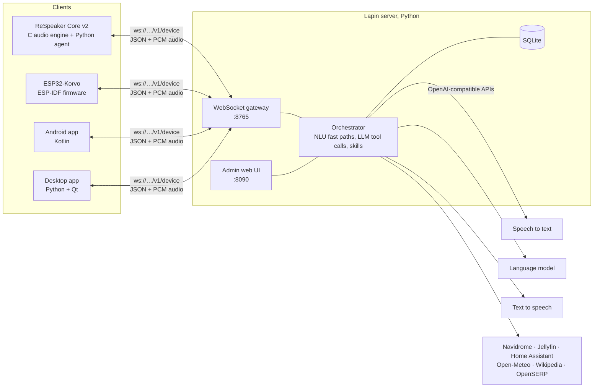

# Lapin

A self-hosted voice assistant for the home, in French and English. Lapin
(French for "rabbit") is a server plus a set of clients: room speakers built on
a ReSpeaker Core v2 or an ESP32-Korvo, an Android app, and a desktop app for
Linux, Windows and macOS. You speak to a client, and the server sends your
words through your own speech-to-text, language model and text-to-speech
services. Nothing goes to a cloud assistant.

> [!WARNING]
> **Lapin is a proof of concept.** It runs every day in one household, but it
> was not built to be exposed to anyone you don't trust. **There is no real
> authentication**, nothing is encrypted, and many features you would expect
> from a commercial assistant are missing. Run it on a private network only.
> See [Limitations and missing features](#limitations-and-missing-features)
> before you install it.

## What it does

- **Wake word on the device.** Say your wake phrase (for example "dis Lapin")
  to a room speaker. The speaker detects it locally, from a few recordings of
  your voice, then the server checks it again before it answers.
- **Natural conversation.** It answers in the language you spoke, keeps a
  short context for follow-up questions, and listens again without the wake
  word when it asked you something. After three requests in a row that it
  can't understand, it says so and stops.
- **Music and radio.** It plays your Navidrome/Subsonic or Jellyfin library
  and internet radio on the room speakers, in one room or in all of them. On
  a phone it uses your own music app instead, for example Tempus.
- **Home and daily life.** Timers, alarms and reminders, weather, time,
  calculations and unit conversions, Wikipedia, web search through a
  self-hosted OpenSERP, Home Assistant devices, announcements and an intercom
  between rooms, and a memory of facts you ask it to keep.
- **Personal devices.** The Android and desktop apps bind to one person and
  offer that device's own actions to the assistant. On a phone that means
  sending a message, calling, navigation, opening an app, timers and media
  control. On a computer it means opening apps, folders and links, media,
  volume, the clipboard and screenshots. Calls, messages and power actions
  always ask for confirmation first.
- **Messaging.** You can also write to the assistant through Telegram, Signal
  or the admin web chat, and it can send you messages there.
- **Admin web UI.** A Flask page for devices, conversations, timers, media,
  people and accounts, skills, integrations, settings and logs. It can also
  turn the browser into a satellite.

## Architecture



All clients use one WebSocket protocol, described in
[docs/PROTOCOL.md](docs/PROTOCOL.md). The room speakers process the sound
themselves: echo cancellation, beamforming, noise suppression and the wake
word. The server does voice detection, end-of-turn detection, recognition,
reasoning and synthesis.

| Folder | What | Language | Guide |
|---|---|---|---|
| [`server/`](server) | the assistant server and its admin web UI | Python 3.11+ | [docs/server.md](docs/server.md) |
| [`satellite/`](satellite) | ReSpeaker Core v2 room speaker: `satd` audio engine and `satagent` | C, Python | [docs/satellite-respeaker.md](docs/satellite-respeaker.md) |
| [`korvo/`](korvo) | ESP32-Korvo V1.1 room speaker firmware and a one-command flasher | C (ESP-IDF 5.5) | [korvo/README.md](korvo/README.md) |
| [`android/`](android) | phone, Android TV and Android Auto app | Kotlin | [docs/android.md](docs/android.md) |
| [`desktop/`](desktop) | Linux, Windows and macOS app | Python + PySide6 | [desktop/README.md](desktop/README.md) |
| [`docs/`](docs) | guides, protocol, algorithms | | |

## Quick start

You need three services that speak the OpenAI HTTP API. Lapin doesn't
include them. The setup it was developed with:

| Service | Endpoint used | Developed with |
|---|---|---|
| Speech to text | `POST /v1/audio/transcriptions` | Parakeet TDT 0.6B |
| Text to speech | `POST /v1/audio/speech` | Qwen3-TTS 1.7B CustomVoice (vLLM-Omni) |
| Language model | `POST /v1/chat/completions`, with tool calling | Qwen 3.x 27B on vLLM |

Then:

```sh
git clone https://github.com/prototux/lapin.git
cd lapin/server
./run.sh                       # creates .venv, installs the dependencies, starts the server
```

1. Open the admin UI at http://localhost:8090. On the **Settings** page,
   enter the URLs, models and tokens of the three services, and **set a web
   password**.
2. On the **People** page, add the members of the household.
3. Connect a client:
   - **Room speaker:** [ReSpeaker](docs/satellite-respeaker.md) (`./deploy.sh respeaker@<ip>`) or [Korvo](korvo/README.md) (`./flash.sh`).
   - **Phone:** install the [Android app](docs/android.md) and make it the default assistant.
   - **Computer:** run `desktop/lapin` ([desktop app](desktop/README.md)).
4. Approve the new device on the **Devices** page.
5. Ask "quelle heure est-il ?" or "what's the weather tomorrow?"

The whole procedure is in [docs/getting-started.md](docs/getting-started.md).

## Documentation

- [Getting started](docs/getting-started.md): from nothing to a first question.
- [Server guide](docs/server.md): settings, people, integrations, skills, messaging channels, privacy.
- [ReSpeaker satellite](docs/satellite-respeaker.md): install, wake word enrollment, tuning.
- [Korvo satellite](korvo/README.md): flashing, Wi-Fi setup, LEDs and buttons, updates over the air.
- [Android app](docs/android.md): assistant key, overlay, phone actions, Android TV, Android Auto.
- [Desktop app](desktop/README.md): shortcut, computer actions, autostart.
- [Developer guide](docs/development.md): code layout, adding a skill or a client, tests, builds.
- [Device protocol](docs/PROTOCOL.md): the WebSocket protocol every client uses.
- [Audio and speech algorithms](docs/algorithms.md): the satellite signal path in detail, from AEC and beamforming to the DTW wake word.

## Limitations and missing features

Lapin is a proof of concept. This is what it lacks, roughly by importance.

### Security

- **No authentication by default.** The admin UI password is empty until you
  set one. Without it, anyone who can reach port 8090 can read the settings,
  conversations and memories, and get a browser token to talk to the
  assistant.
- **One shared admin password, no user accounts.** There are no per-person
  logins, roles or audit trail on the admin UI.
- **No encryption.** The admin UI uses plain `http://` and the clients use
  plain `ws://`. Device tokens, audio and transcripts all travel unencrypted
  on the network. There is no TLS support. A reverse proxy could add it, but
  this has not been tested.
- **Weak device trust.** A device is identified by a random token it
  generated itself. Approval is a click in the admin UI, and `auto_approve`
  skips even that.
- **No speaker identification.** Anyone in a room can use the assistant with
  that speaker's household settings. On a phone or computer, the requests
  count as the owner's.
- **Unsigned firmware updates.** The Korvo accepts any image the server sends
  over the air.
- **Device setup pages.**
  - The ReSpeaker's web page (port 8080) has no password by default.
  - The Korvo's setup access point is an open Wi-Fi network.

### Features

- **Two languages only**, French and English. The admin UIs are in English
  only.
- **Recognition, the language model and the voices are not included.** You
  need to run your own OpenAI-compatible services, usually on a GPU.
- **No installer or packages.** There is no Docker image, pip package, APK
  release, signed desktop build or prebuilt Korvo firmware yet: you build
  everything from source.
- **Single process, single SQLite file, no backup or export tool.**
- **The Korvo can't enroll a wake word.** It reuses the recordings made on a
  ReSpeaker satellite. Without one, only its talk button starts a request.
  It uses one microphone, with no beamforming.
- **The ReSpeaker has no over-the-air updates.** You redeploy it with SSH.
- **The phone and computer apps have no wake word.** They are push-to-talk:
  the assistant key, a shortcut or a button.
- **Android limits.**
  - Signal messages are opened as a draft for you to send, because Signal has
    no API for this.
  - Android Auto support is basic.
  - Some phone actions have only been tested on one phone.
- **The desktop app is mostly tested on Linux.** Windows and macOS support is
  written but has had little testing.
- **No multi-household or remote-access mode.** It is built for one LAN.
- **No automated test suite for the server.** There is only an end-to-end
  script. The Android, desktop and Korvo code have unit tests.

### Skills not implemented yet

- Calendar and agenda: reading and managing it (CalDAV, Google Calendar). The phone app can only open a prefilled event
- Email: reading and sending
- Shopping lists and to-do lists
- Routines and automations, such as "good night" turning the lights off and setting an alarm
- News briefings, podcasts and audiobooks
- Spotify, YouTube Music, Deezer, or any streaming service other than Subsonic and Jellyfin
- Traffic, commute times and public transport
- Package tracking
- Recipes and cooking help with step-by-step timers
- Translation mode
- Phone calls through a room speaker
- Cameras, doorbells and video
- Sports scores and stock quotes
- Voice profiles to tell household members apart

Contributions toward any of these are welcome. See the
[developer guide](docs/development.md).

## License

[Apache License 2.0](LICENSE).
