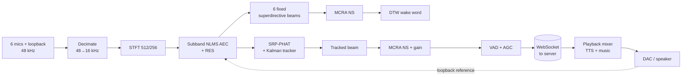

# Lapin satellite — audio & speech algorithms

A detailed description of the signal processing in the ReSpeaker satellite (`satellite/engine`), written for readers who know DSP. The ESP32-Korvo firmware reuses the wake word part (`korvo/components/satcore`) but relies on Espressif's ESP-SR AFE for echo cancellation; see [satellite-korvo.md](satellite-korvo.md).

## Overview

The satellite turns six raw microphones into one clean 16 kHz voice stream, decides on its own when someone says the wake word, and plays the server's answers and music. Everything that must react within milliseconds runs on the board; speech recognition, the language model and speech synthesis run on the server.

- **Hardware:** ReSpeaker Core v2, a 6-microphone circular array plus playback loopback, on a small ARM board running the Debian 13 image built for it.
- **`satd`, the audio engine (C):** one real-time loop that processes 16 ms of sound per step (256 samples at 16 kHz, analysed with a 512-point FFT). It does echo cancellation, direction finding, beamforming, noise suppression, voice detection, the wake word and the playback mixer.
- **`satagent`, the agent (Python):** relays between the engine and the server over a WebSocket, runs the local web UI and the LED ring plugin, and handles the button.
- **Budget:** each 16 ms step costs about 5 ms of CPU on the board, measured with the radio playing, so the loop keeps a wide real-time margin.



The wake word listens on six fixed beams at once; once it fires, the request is taken from the one beam that follows the talker.

## Capture and front end

The codec delivers 8 interleaved channels at 48 kHz: the 6 microphones and a stereo loopback of the DAC output, sampled on the same clock. The echo reference is r = (L + R)/2 of that loopback, so the canceller sees the exact signal sent to the amplifier with a fixed, sample-accurate delay.

**Decimation, 48 → 16 kHz, per channel.** A 96-tap Kaiser-windowed sinc FIR (β = 8, cutoff 7.2 kHz, normalized to unit DC gain), evaluated only at every 3rd output sample over a doubled ring buffer, so the 96-sample window is always contiguous. That is 96 MAC per output sample, or 1.5 MMAC/s per channel. β = 8 gives roughly 80 dB of stopband from about 8.5 kHz; the little that folds back lands above 7.5 kHz, where speech carries almost nothing.

**Conditioning at 16 kHz.** A one-pole DC blocker per channel, then a per-microphone trim gain to match the capsules:

```math
y[n] = x[n] - x[n-1] + 0.985\,y[n-1] \qquad (f_c \approx 38\ \text{Hz at } 16\ \text{kHz})
```

**STFT.** N = 512 (32 ms), hop R = 256 (16 ms), a square-root Hann window on both analysis and synthesis. √Hann × √Hann = Hann, which sums to a constant at 50 % overlap, so the weighted overlap-add reconstructs exactly when no processing is applied. The analysis/synthesis pair costs one window, about 32 ms, of algorithmic latency.

**FFT.** The 512-point real FFT runs as a 256-point complex radix-2 FFT on z\[n\] = x\[2n\] + j·x\[2n+1\], followed by the split step:

```math
X[k] = \tfrac{1}{2}\big(Z[k] + Z^*[M-k]\big) - \tfrac{j}{2}\,W_N^{k}\big(Z[k] - Z^*[M-k]\big), \quad M = 256,\ W_N = e^{-j2\pi/512}
```

That gives 257 bins of 31.25 Hz. Everything below works on 7 spectra per hop (6 microphones and the reference), in single-precision float, built with `-O2 -ffast-math -mfpu=neon-vfpv4` for the Cortex-A7.

## Echo cancellation

Two stages run on the spectra before anything spatial: a per-bin linear canceller, then a residual suppressor for what the small speaker distorts. Live, with the radio playing, the first gave 7–9.5 dB of ERLE and the second about 8 dB more.

### Subband NLMS canceller (default)

For each microphone m and bin k, a complex FIR over the last L reference spectra (taps 16 ms apart) predicts the echo:

```math
\hat Y_m(k,\ell) = \sum_{i=0}^{L-1} W_{m,i}(k)\,R(k,\ell-i), \qquad E_m(k,\ell) = X_m(k,\ell) - \hat Y_m(k,\ell)
```

```math
W_{m,i}(k) \leftarrow W_{m,i}(k) + \frac{\mu_\text{eff}}{\sum_{i}|R(k,\ell-i)|^2 + \delta}\,E_m(k,\ell)\,R^*(k,\ell-i)
```

- **Size:** L = ⌊(tail\_ms + 15)/16⌋, clamped to at least 2; the 96 ms tail in use gives L = 6. Each hop costs 6 mics × 257 bins × 6 taps complex MACs for the filter, and as many for the update.
- **Model limits:** no cross-band filters. With 50 % overlap and a √Hann window, leakage between neighbouring bins caps the achievable ERLE. That is accepted: the residual suppressor takes over.
- **Regularization:** δ = 0.01 × (the mean over bins of the per-bin reference power) + 10⁻¹⁰, so quiet bins don't get huge steps.
- **Step size:** μ = 0.3. μ\_eff is 0 when the reference is silent (total reference energy under about −70 dBFS), min(1, 1.5μ) for the first 60 active frames to converge fast, and 0.03μ during double talk.
- **Double talk:** declared after 150 active frames when, with energies summed over all mics and bins, ‖E‖² > 2‖Ŷ‖² with near speech detected, or ‖E‖² > 8‖Ŷ‖² whatever the VAD says.
- **ERLE estimate:** exponential averages (0.97) of input and output power, updated only on far-end-only frames.
- **Why not speexdsp's MDF:** it is still selectable (`aec_mode speex`: a multichannel partitioned-block frequency-domain filter on the raw 16 kHz signals). On this board it diverged on loud playback: the speaker's distortion makes the echo partly non-linear, and a long full-band filter chasing that blew up. Short per-bin filters with a hard step cap cannot run away like that.

### Residual echo suppressor (RES)

It models the residual echo power per bin as a linear function of the reference power in that bin and of the total reference power, which captures harmonics and rattle spread across frequencies:

```math
\hat P_\text{echo}(k) = a_k\,\tilde P_r(k) + b_k\,\tilde P_{r,\text{tot}}, \qquad \tilde P_r(k) = \max\big(P_r(k),\ 0.75\,\tilde P_r(k) + 0.25\,P_r(k)\big)
```

The max/decay smoothing of the reference stands for the room's decay after the reference stops. Bins 0–2 (DC) are ignored.

- **Fit:** recursive least squares on a and b with forgetting factor λ = 0.995 (about 3 s), by solving the 2×2 normal equations each frame with 1 % diagonal loading. If the solution has a negative coefficient, it falls back to the single regressor that explains more energy, clamped at 0.
- **When it learns:** after 120 training frames, only when the total residual power stays under 4 × the predicted echo (its own double-talk test, independent of the VAD, which the echo fools). Before that, it trains whenever there is no near speech, or the reference is strong compared to what the mics hear (P\_r,tot > 0.3 × the residual power).
- **Gain:** spectral subtraction with over-subtraction β = 1 and a floor g\_min = −10 dB, where P\_e is the post-AEC power averaged over the six mics.

```math
g_k = \operatorname{clip}\Big(1 - \beta\,\frac{\hat P_\text{echo}(k)}{P_e(k)},\ g_\text{min},\ 1\Big)
```

- **Smoothing:** instant attack (a lower gain applies at once), release g ← g + 0.3(g\_new − g) per frame, so it doesn't pump on the echo tail. With no reference, gains recover by +0.1 per frame.
- **Phase preserving:** the same real gain multiplies all six microphones, so inter-mic phase differences, which DOA and beamforming need, are untouched.
- **"Far-only" flag:** reference active, RES trained and no RES double talk. Then whatever the mics localize is our own speaker. The flag gates the tracker and the wake word (below).

## Direction finding and tracking

SRP-PHAT on the echo-cancelled spectra gives candidate bearings every 32 ms. A Kalman tracker with a map of static interferers turns them into one steering angle for the voice beam.

### Array and steering

- **Geometry:** a uniform circular array, 6 capsules on a circle of radius 46.3 mm (adjacent spacing = radius = 46.3 mm). Adjacent pairs alias spatially above c/2d ≈ 3.7 kHz, opposite pairs (92.6 mm) above 1.85 kHz; the SRP band stops at 4 kHz.
- **Steering vectors:** far field, 2-D (azimuth only), on a 4° grid (90 cells), precomputed for all 257 bins, with c = 343 m/s and u(θ) = (sin θ, cos θ):

```math
d_m(k,\theta) = e^{-j2\pi f_k \tau_m(\theta)}, \qquad \tau_m(\theta) = -\frac{\mathbf p_m \cdot \mathbf u(\theta)}{c}
```

### SRP-PHAT

Computed every second hop (32 ms) over bins 7–128 (219 Hz – 4 kHz), with optional per-bin weights w\_k:

```math
P(\theta) = \frac{1}{M^2 \sum_k w_k^2} \sum_{k=7}^{128} \Big|\sum_{m=1}^{M} d_m^*(k,\theta)\,\frac{w_k\,X_m(k)}{|X_m(k)|}\Big|^2 \ \in [0, 1]
```

- This equals the sum of the GCC-PHAT of all 15 pairs plus a constant, at 90 × 122 × 6 complex MACs per evaluation instead of 15 cross-spectra per direction.
- **Speech weighting:** when near speech is present (VAD on, not far-only), w\_k is the Wiener gain of a separate noise estimator on microphone 1 (floor −40 dB), so bins dominated by stationary noise (fan, hum) barely vote. Otherwise w\_k = 1.
- **Peaks:** the two strongest local maxima at least 32° (8 cells) apart, refined by parabolic interpolation (offset 0.5(l − r)/(l − 2c + r), clamped to ±0.5 cell).
- **Confidence:** (P\_peak − mean P)/(1 − mean P). The second peak is dropped as a sidelobe when its excess over the mean is less than half the first's.
- **Wake direction:** taken from the DOA peaks of the last \~1.2 s, weighted by confidence, not from the beam that fired, which has only 60° resolution.

### Kalman tracker

State x = \[θ, ω\] (degrees, degrees/s), constant-velocity model with dt = 16 ms:

```math
F = \begin{bmatrix}1 & dt\\ 0 & 1\end{bmatrix}, \quad \omega \leftarrow 0.97\,\omega \text{ per hop}, \quad Q = \operatorname{diag}(1.92,\ 38.4)\ \text{per hop}
```

- P₀₀ is capped at 180² and P₁₁ at 400. The ω decay encodes that a talker stops more often than they drift.
- **Measurement:** the peak closest to the track among the non-static ones, with std r = 9°/max(confidence, 0.1) and the scalar innovation wrapped to ±180°. It updates only on near-speech frames with confidence > 0.12.
- **Gate:** 45°, or 27° for 1.44 s after a lock. A measurement outside the gate starts an alternative track (an EMA with gain 0.3, kept while it stays within 25°). After 25 consecutive updates (about 0.8 s of speech) the tracker re-locks onto it.
- **Lock (wake word, or first valid measurement):** θ = the wake bearing, ω = 0, P = diag(15², 50).

### Static-interferer map

- **Accumulation:** a 90-cell map s(θ) decays by 0.9995 per hop (about 30 s memory). Each confident peak (confidence > 0.12) adds rate × confidence to its cell: 0.02 when nobody has spoken for 500 ms or the playback is far-only, and only 0.0004 during speech. A TV that talks for minutes gets marked; a person speaking for 30 s in one spot doesn't.
- **Effect:** a cell is static when s > 0.5 there or in a neighbouring cell. Static peaks are not candidates for the tracker, except just after a lock.
- **Clearing:** a lock clears ±3 cells (±12°) around the wake bearing, since the user just spoke from there, so someone sitting next to the TV can still be tracked.

## Beamforming

All beams are frequency-domain filter-and-sum, Y(k) = w(k)ᴴX(k), with superdirective (diffuse-noise MVDR) weights by default. Six fixed beams feed the wake word; one beam steered by the tracker produces the voice that goes to the server.

### Superdirective weights

MVDR against a spherically isotropic (diffuse) noise field, whose coherence between mics i and j at distance d\_ij is a sinc, plus diagonal loading ε = 0.05:

```math
\Gamma_{ij}(f) = \frac{\sin(2\pi f d_{ij}/c)}{2\pi f d_{ij}/c} + \varepsilon\,\delta_{ij}, \qquad \mathbf w(k) = \frac{\Gamma^{-1}\mathbf d}{\mathbf d^H \Gamma^{-1} \mathbf d}
```

- On a 46 mm array, Γ is close to singular at low frequencies, and unloaded superdirective weights blow up the white-noise gain: capsule self-noise and mismatch get amplified. The loading trades directivity for robustness. 0.05 is a fixed setting (bf\_loading, configurable from 0.001 to 10), not adapted at run time.
- Γ⁻¹d is solved per bin by Gaussian elimination with partial pivoting on the 6×6 complex system; no inverse is stored. If the system is singular, it falls back to delay-and-sum, d/M.
- **Fixed bank:** 6 beams at 0°, 60°, … 300°, weights computed once at start: 6 × 257 × 6 complex MACs per hop to apply. Each beam has its own noise suppressor and VAD (next section), wake-word front end and detector, and a 16-bit time-domain ring buffer (via its own ISTFT) for the pre-roll.

### Tracked beam

- **Steering:** the tracker's angle, quantized to the 4° grid. Weights are recomputed only when the grid cell changes.
- **Modes:** superdirective (default), delay-and-sum, raw microphone 1, or adaptive MVDR.
- **Adaptive MVDR (off by default):** the noise covariance is learned per bin from frames with no speech for 300 ms, R ← 0.985R + 0.015·XXᴴ (about 1 s of noise). It is seeded with 10⁻⁶Γ, so it equals the superdirective beam until it has learned. Diagonal loading is ε·tr(R)/M, weights are refreshed every 4 hops, and it needs at least 30 noise frames before use.
- **Why adaptive MVDR is off:** whenever the VAD missed part of the talker's speech, that speech went into R as noise, and the beam put a null on the talker (classic signal cancellation). Superdirective cannot do that. Persistent interferers are handled instead by the tracker's static map, which keeps the beam off them.

## Noise suppression, voice detection and gain

Each beam (6 fixed + the tracked one, plus an omni estimator on mic 1 for the DOA weights) runs the same single-channel estimator: MCRA noise tracking, a decision-directed Wiener gain, and a band-SNR voice detector.

### Noise estimate (MCRA)

Per bin k and hop ℓ, with P = |Y|²:

```math
S = 0.8\,S + 0.2\,(0.25\,P_{k-1} + 0.5\,P_k + 0.25\,P_{k+1}), \qquad I = [\,S > 5\,S_\text{min}\,], \qquad p = 0.8\,p + 0.2\,I
```

```math
\alpha_d = 0.95 + 0.05\,p, \qquad N = \alpha_d N + (1 - \alpha_d)\,P, \qquad N \leftarrow \min(N,\ 2.5\,S_\text{min})
```

- **Minimum tracking:** two interleaved sub-windows of 125 hops (2 s), giving a 2–4 s minimum search.
- **Bootstrap:** the first 8 hops average P directly.
- **The 2.5× cap:** speech onsets arrive before p rises. Without the cap, N crept up through long sentences and the voice detector fell to about 8 % of the speech.

### Gain

A decision-directed a-priori SNR and a Wiener gain with a floor:

```math
\gamma = \frac{P}{N}, \qquad \xi = 0.98\,G_{\ell-1}^2\,\gamma_{\ell-1} + 0.02\,\max(\gamma - 1,\ 0), \qquad G = \max\Big(\frac{\xi}{1+\xi},\ G_\text{min}\Big)
```

G\_min is −8 dB on the beams, −20 dB when building wake-word templates, and −40 dB on the DOA weight estimator. Speech recognizers degrade more from musical noise and watery speech than from leftover stationary noise, so the floor on the voice path stays gentle.

### Voice detection

```math
\text{SNR} = 10\log_{10}\frac{\sum_{k=10}^{128} P_k}{\sum_{k=10}^{128} N_k}\ \ (312\ \text{Hz} - 4\ \text{kHz}), \qquad p_v = 0.6\,p_v + 0.4\,\sigma\!\Big(\frac{\text{SNR} - 6\ \text{dB}}{1.5\ \text{dB}}\Big)
```

- **Frame decision:** a hop is speech when the maximum p\_v over the 6 fixed beams exceeds 0.5. A hangover of 19 hops (304 ms) bridges the gaps between words.
- **Speech history:** a 256-hop history keeps two bits per hop: "any voice", and "voice while not far-only". The second one tells a nearby talker from our own playback's residue. The wake-word gate below reads it.
- **Device end of speech:** 1.2 s without speech after some speech. It is only a hint; the server decides the real end of turn.

### AGC (voice path only)

In the time domain after the ISTFT. The level is measured per hop, and the gain moves only on speech hops above −70 dBFS: toward clamp(−20 dBFS − level, −12, +24) dB, with coefficient 0.25 per hop going down and 0.015 going up. The gain is interpolated per sample. A peak limiter follows: ceiling 0.89 (about −1 dBFS), instant attack, release by a factor of 1/0.9995 per sample.

## Wake word

"Dis lapin" is a personal wake word: there is no trained model, only template matching against a few recordings of the household saying it. Every fixed beam runs its own detector: MFCC-like features, then online subsequence DTW against every template, at one DTW column per template per 16 ms hop. The server then verifies each wake (next sections).

### Features (per beam, per hop)

1. **Mel energies:** 32 triangular mel bands from 80 Hz to 7.6 kHz over the beam's noise-suppressed power spectrum. Narrow low bands with no bin inside take their nearest bin.
2. **Relative floor:** each band is floored at E\_max · 10^(−20/10), 20 dB under the strongest band of that frame. Weak bands, where noise and its suppression dominate, then look the same in clean templates and noisy input.
3. **Cepstra:** c\_i = Σ\_b cos(π i (b + ½)/32) · ln E\_b for i = 1…12 (c₀ dropped), liftered by 1 + 11 sin(π i/22).
4. **Energy:** e = ln Σ\_b E\_b is kept as a 13th coefficient. After mean normalization it tells silence and soft noise from speech, which the spectral shape alone cannot.
5. **Normalization:** a running mean per detector, updated only on speech hops, μ ← μ + 0.004(x − μ) (about 4 s of speech). It starts from the templates' mean; templates use their own utterance mean.
6. **Vector:** v = \[c̃ (12), 3ẽ, Δc̃ (12), 3Δẽ\], with causal deltas Δx = x(t) − x(t−2), scaled to unit length. 26 dimensions; the energy terms are weighted ×3.

The frame distance is cosine: d(v, t) = max(0, 1 − ⟨v, t⟩).

### Templates

Each enrollment WAV (16 kHz) goes through the same STFT, a −20 dB noise suppressor and the same features. The word spans the first to last frame with SNR > 8 dB, padded by 2 frames before and 3 after, between 12 frames (192 ms) and 125 frames (2 s). A recording is rejected at enrollment when it is empty, starts too early, is cut off, or is inconsistent with the others. The model holds up to 48 templates in all, positives and negatives together.

### Online subsequence DTW

For each template of length L, one column of L cells is updated per hop, in place. D(i) is the accumulated cost of the best path ending at template frame i now; S(i) is the time that path started.

```math
D_t(i) = \min\Big\{\ \underbrace{D_{t-1}(i-1) + 2d}_{\text{diagonal}},\ \underbrace{D_t(i-1) + d}_{\text{vertical}},\ \underbrace{D_{t-1}(i) + d}_{\text{horizontal}}\ \Big\}, \qquad D_t(0) = 2d \ \ (\text{free start})
```

- **Normalization:** the three predecessors are compared by normalized cost D/(L + span), with span = t − S + 1 (symmetric2 normalization), not by raw D.
- **Path limit:** a path whose span exceeds 1.7L is dropped, so a fresh start can take the cell. Long babble cannot be stretched into a match.
- **Output:** at i = L−1, with 0.6L ≤ span ≤ 1.7L, the template's cost is D/(L + span). The detector reports the best positive cost and its span, how many positive templates are under the threshold, and the best negative template's cost.
- **Cost:** about L × 26 MACs per template per hop. With 10 templates of about 60 frames on 6 beams, that is roughly 94k MACs per hop.

### Decision

A candidate needs all of these on the best beam:

1. **Cost under threshold:** cost < θ.
2. **Agreement:** enough templates under θ. Automatic setting: 2 when at least 3 positives are enrolled and nothing is playing, else 1. It can be forced by configuration; this satellite is currently set to 1.
3. **Negative margin:** the closest negative template is at least 0.04 farther than the best positive.
4. **Speech coverage:** voiced hops in the matched span. In a quiet room, 60 % with the "not far-only" bit; over music, 40 % with "any voice". Over music the RES's near/far decision is unreliable for a distant voice, so any voice counts.
5. **Warm-up:** at least 1 s since start.

The candidate is then refined while its cost keeps improving. It fires 4 hops (64 ms) after the cost stops improving: peak picking on a local minimum. The wake carries a score of clamp(1 − cost/(2θ\_config), 0, 1), the 1.5 s pre-roll from the winning beam's ring buffer, and the matched audio (span + 24 hops, up to 2 s). Then a 1.5 s refractory period starts and all detectors reset.

### Thresholds

The automatic threshold is the median, over positive templates, of each one's nearest-neighbour whole-sequence DTW cost (symmetric2, leave-one-out) to the others, plus 0.06, clamped to 0.36–0.46. One odd recording doesn't loosen it for everyone.

| Situation | Effective θ | Why |
| --- | --- | --- |
| Quiet room | auto, 0.42 here | The household's own spread between repetitions |
| Music or radio playing | θ + 0.08 | The echo residue raises every cost, the user's voice included |
| Its own answer playing | min(θ, 0.44) | The residue is a voice, the one thing the templates can match |

### Learning from mistakes

When the server rejects a wake with a low verification score (< 0.6), and the wake didn't happen during playback, the satellite saves the matched audio as a negative template, keeping up to 20 per keyword. Genuine wakes during playback are never learned as negatives.

The "random cutting" fixed on 4 October came from this table. The threshold had been set to 0.54 by hand, and the music margin also applied during the assistant's own answers. It then accepted its own voice (costs 0.55–0.60), interrupted itself and opened empty turns. The own-voice ceiling and the automatic threshold now prevent that.

## Playback

The mixer runs at 48 kHz stereo. Its job for the rest of the chain is to keep the echo path linear and predictable: a clipping amplifier makes echo that no linear canceller can follow.

- **Streams:** each server stream (speech at 24 kHz mono, music at 48 kHz stereo) has its own jitter buffer and pre-buffer (1 s by default for music, set per stream by the server). It also has an underrun state that resumes cleanly.
- **Resampling up:** integer polyphase FIR interpolators, 32 taps per phase, Kaiser β = 8: ×2 (24 → 48 kHz, cutoff 11 kHz) and ×3 (16 → 48 kHz, cutoff 7.6 kHz).
- **Synchronized start:** a stream may carry a start time on the server clock. The agent converts it to the board's clock with an NTP-style offset, t1 − (t0 + t2)/2, taken from the lowest-round-trip exchange among the last 8 pings. The mixer holds the stream until now + output latency reaches the start time, so several satellites start a song together.
- **Priorities and ducking:** music drops by 40 dB while the microphone is open and by 18 dB under speech, earcons or alarms; speech drops by 12 dB under an alarm. Gains move with one-pole ramps, a 12 ms time constant going down and 300 ms going up. A new stream starts directly at its target gain, so it doesn't swell in.
- **Earcons:** synthesized locally with no network latency: a sine plus a decaying 2nd harmonic (0.18 sin 2φ · e^(−t/50 ms)) and 0.06 of the 3rd, with a 4 ms attack.

### Output chain

All the filters are biquads; the dynamics run on a peak envelope.

| Stage | Setting |
| --- | --- |
| Master volume | ramped, 0–100 |
| High-pass | 90 Hz, Q 0.707 |
| Low shelf | 150 Hz, Q 0.7 |
| Peaking EQ | 1.2 kHz, Q 0.9 |
| High shelf | 6 kHz, Q 0.7 |
| Compressor | threshold −14 dB, ratio 3:1, attack 5 ms, release 150 ms |
| Peak limiter | ceiling −1 dBFS, instant attack, release 80 ms |

The high-pass keeps the small speaker out of its non-linear excursion range, which also helps the echo canceller.

## What the server does with it

The satellite proposes a wake and streams 16 kHz audio (the tracked beam after noise suppression and AGC). The server decides whether the wake is real, when the request ends, and what was said.

### Arbitration

Wakes from several satellites within 180 ms are compared by the wake score plus an SNR bonus, min(max(SNR/30 dB, 0), 1) × 0.3. Only the best one answers.

### Wake verification (stage 2)

The 1.5 s pre-roll is transcribed by the server's recognizer (Parakeet) and compared with "dis lapin" and its aliases. An alias is the transcript of an enrollment recording, kept when its own similarity to the phrase is at least 0.8; recognizers spell made-up words many ways.

```math
\text{sim}(a,b) = \max\big(r(a,b),\ 0.95\,r(\phi(a),\phi(b)) + 0.05\,r(a,b)\big)
```

r is difflib's SequenceMatcher ratio on the strings without spaces. φ is a crude phonetic key: digraphs merged (ph → f, ch/sh → s…), consonants folded into classes (b/p, d/t, g/k/c/q, v/f, s/z/j, m/n), all vowels folded to one, and repeats collapsed. The phrase is matched against every window of the transcript of its own length ±1 word. A score of 0.75 or more is a pass.

| Pre-roll result | Decision |
| --- | --- |
| Score ≥ 0.75 | accepted |
| Clearly other speech: score < 0.35 and ≥ 10 letters | rejected at once; the satellite learns a negative |
| Too short to judge ("Mm", "Dina") | undecided: re-checked on the full request's transcript with the wake phrase in context, or accepted if the detector score is ≥ 0.55 |
| Doubtful, over music (score ≥ 0.45 or ≤ 6 letters) | accepted: the music garbles the clip |
| Doubtful, over the assistant's own answer | not lenient: that residue is the likeliest false wake |

### End of turn

The server runs its own voice detector on the stream, on 20 ms frames:

- **Speech test:** the frame must be more than 9 dB above an adaptive noise floor (fast down, slow up, faster during the first second) and above −58 dBFS, AND the WebRTC VAD (mode 3) must call it speech. The second test rejects loud non-speech noise.
- **Phones and computers (near field):** once 300 ms of the user's speech is heard, voices more than 12 dB below their level (a decaying peak, −1 dB/s) count as background. That covers TV, announcements and colleagues.
- **Hangover:** 160 ms.

The turn ends:

1. after 800 ms of silence, if the transcript of what was heard so far reads as complete: it doesn't end with a comma or an ellipsis, and its last word isn't an article, preposition, conjunction or "please" in French or English;
2. otherwise after 1.6 s of silence;
3. at the latest after 20 s of audio, or 25 s of wall-clock time if the audio stops coming. A turn with no speech within 9 s is dropped.

The satellite's own end-of-speech (1.2 s) and a button release are hints that shorten this.

### Recognition

The request is transcribed from the live audio only, without the pre-roll: a fragment of the wake word biased the recognizer toward English. The recognizer's server sometimes fails on particular input lengths or under GPU memory pressure. The client retries short clips with 0.25–1.2 s of silence appended, and splits long clips recursively at their quietest point.

## Measured performance and limits

| Measure | Value | Conditions |
| --- | --- | --- |
| CPU per 16 ms step | about 5 ms | radio playing, all stages on |
| Linear echo cancellation | 7–9.5 dB | radio at the usual volume |
| Residual echo suppression | about 8 dB more | same |
| Audio dropouts | none | same session |
| Wake word detected over radio | 6 of 6 | one recorded session |
| Self-wakes during its own speech | 0 in about 70 s | volume 100, with the own-voice ceiling |

Known limits:

- **Loud music still costs detections:** the echo residue raises match costs, so some genuine wakes over loud music are missed. The 0.08 music margin trades that against false wakes.
- **Short French phrases:** the server's recognizer sometimes mishears them ("Keller and Teal" for "Quelle heure est-il"). That is a recognition limit, not a capture one: longer sentences come through fine.
- **The wake word is personal:** a voice not enrolled, or the same voice much farther away, matches less well. Recording a few more samples on the Wake word page helps more than raising the threshold.
