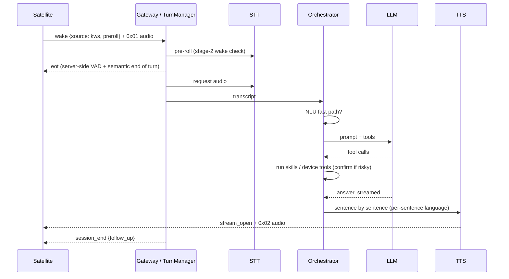

# Developer guide

How the code is organised, how a request flows through it, and how to build
and test each part.

**Languages:** C and Python, plus Kotlin for Android. Avoid JavaScript apps;
the admin pages use small vanilla JS.

**No heavy frameworks:**

- **Server:** Flask and websockets.
- **Desktop app:** PySide6.
- **Korvo firmware:** ESP-IDF and ESP-SR.

## Repository layout

```
server/                 Python server
  assistant/
    __main__.py         entry point: python -m assistant --data DIR
    app.py              wires everything together
    gateway.py          device WebSocket: hello/pairing, audio, routing of messages
    devices.py          DeviceSession: one connected device, its tools, playback
    sessions.py         TurnManager: wake → listen → end of turn → answer, follow-ups, misses
    audio.py            VAD (WebRTC + adaptive energy floor + near-field gating), decoding
    verifier.py         stage-2 wake word check
    clients.py          STT / TTS / LLM HTTP clients (OpenAI-compatible)
    orchestrator.py     one turn: fast paths, prompt, LLM tool loop, guards
    nlu.py              regex fast paths (time, timers, play, next, stop, volume…)
    router.py           output routing: speech to the asking device, music to rooms, ducking
    composer.py         makes the answer speakable (no markdown, no stage directions)
    lang.py             French/English detection, fixed phrases
    guardrails.py       confirmation of risky tools, rate limits
    skills/             tools exposed to the model, one module per skill
    channels/           Telegram, Signal, web chat
    media.py            radio / music streams, multi-room
    firmware.py         Korvo OTA and remote logs
    wakewords.py        wake word recordings shared between satellites
    store.py            SQLite
    webui.py, static/   admin web UI (Flask + vanilla JS)
  tests/fake_device.py  end-to-end voice turn without hardware
satellite/              ReSpeaker Core v2
  engine/src/           satd: AEC (sbaec, aec, res), DOA (track), beam, ns, kws, mixer, ipc
  engine/tests/         offline tools: simulate.py, kwstest, kwsscan, replay_asr.py
  agent/satagent/       agent: link to the server, web UI, button, plugins/leds
  install.sh deploy.sh systemd/
korvo/                  ESP32-Korvo V1.1 firmware (ESP-IDF 5.5)
  main/                 board code: audio (ESP-SR AFE), LEDs, buttons, Wi-Fi portal, OTA
  components/satcore/   portable core: protocol, wake word (port of kws.c), mixer, OTA logic
  test/                 host tests and QEMU apps
  build.sh flash.sh flash.py
android/                Kotlin app (Compose): voice/, core/, protocol/, tools/, music/, audio/, ui/, car/
desktop/                PySide6 app: lapin_desktop/, tests/
docs/                   guides, PROTOCOL.md, algorithms.md
```

## How a voice request flows



Guards in `orchestrator.py` catch the usual failure modes of local models
before an answer is spoken:

- **Wrong language:** an answer in the wrong language is regenerated.
- **Claimed action:** "I've turned off the lights" with no tool call is
  regenerated.
- **Refusals:** they are not kept in the history.
- **Preambles:** a preamble before a silent tool is dropped.
- **Misunderstood requests:** they are counted. After
  `assistant.max_misses` in a row, the turn ends.

## Adding a skill

Create `server/assistant/skills/<name>.py`. Modules are discovered
automatically.

```python
"""Jokes (one line describing the skill: shown on the Skills page)."""

from . import tool

EXAMPLES = {"en": ["Tell me a joke"], "fr": ["Raconte-moi une blague"]}


@tool("Tell a short, family-friendly joke.",
      {"topic": ("string", "optional topic")})
def tell_joke(ctx, topic=""):
    return {"joke": "…"}           # a short JSON-able dict, sent back to the model
```

- **The description is the prompt.** Say when to use the tool and when not
  to: the model picks tools from their descriptions alone.
- **Arguments and options.**
  - `ctx` gives `ctx.settings`, `ctx.user`, `ctx.room`, `ctx.device_id`,
    `ctx.app` (store, media, devices…).
  - `risk="confirm"` makes the server ask the user before running it.
  - `available=lambda app: …` hides it when its service isn't configured.
- **Errors:** return `{"error": "…"}` with a hint the model can act on ("no
  home location configured; ask the user for a city"). Don't raise.
- **Frequent, unambiguous commands** deserve a fast path in `nlu.py`, which
  answers in milliseconds without the model.

## Adding a device tool or a new client

A client declares its own tools in `hello` (or later with `tools`), with a
JSON schema, `confirm`, `silent` and `replaces`. The server offers them to
the model only for that client's own requests, and relays the calls as
`tool_call` and `tool_result`. See [PROTOCOL.md](PROTOCOL.md):

- §1: pairing;
- §5: device tools;
- §6: confirmations.

The Android `ToolSpecs.kt` and desktop `lapin_desktop/tools/` are working
examples.

## Building and testing

The development machine had no swap, and every heavy build runs inside a
memory cap (`systemd-run --user --scope -p MemoryMax=…`). The build scripts
do this for you when systemd is available.

| Part | Build | Tests |
|---|---|---|
| server | `server/run.sh`; image: `docker build -t lapin-server server` | `python tests/fake_device.py "what time is it?"` against a running server (end to end, uses the TTS to synthesize the question) |
| satellite engine | `make -C satellite/engine` (on the board, or with an ARM cross compiler); package: `satellite/packaging/build-deb.sh` | `satellite/engine/tests/simulate.py` (synthetic room, AEC/DOA numbers); `kwstest`/`kwsscan` on recordings; `replay_asr.py` (needs `STT_TOKEN` if your STT wants one) |
| Korvo firmware | `korvo/build.sh` (ESP-IDF v5.5 in `~/esp/esp-idf` or `IDF_PATH`) | `korvo/test/run_tests.sh`: host tests of satcore (KWS, mixer, protocol, log buffer, OTA); with a server running, also on the real wake word recordings |
| Android | `android/build.sh` (JDK 17–21) | `./gradlew testDebugUnitTest` (JVM tests); `LiveServerTest` with `LAPIN_LIVE_WS=…` against a server |
| desktop | `desktop/lapin`; packages: `desktop/packaging/build.py` (Windows, macOS), the Flatpak manifest (Linux) | `.venv/bin/python -m unittest discover -s tests` (`QT_QPA_PLATFORM=offscreen` headless) |

### Testing without hardware

- **The browser:** the admin UI's **Talk & chat** page is a full satellite,
  with microphone, speaker and the same protocol.
- **A fake device:** `server/tests/fake_device.py` runs a whole voice turn
  through the WebSocket.
- **A fake Korvo:** `korvo/test/hostsat` runs the Korvo's portable core on
  your PC, connected to a real server through `ws_bridge.py`.

## Continuous integration and releases

Two GitHub Actions workflows, in `.github/workflows/`:

- **`ci.yml`**, on every push to `main` and every pull request: starts the
  server and builds its Docker image; builds `satd` and the ReSpeaker
  package on Debian 13; builds the Korvo firmware in Espressif's ESP-IDF
  image and runs its host tests; runs the Android unit tests and builds the
  debug APK; runs the desktop unit tests. The Korvo images and the debug APK
  are kept as artifacts of the run for two weeks.
- **`release.yml`**, on a version tag: builds every package and publishes
  them in a GitHub release.

| Part | Package | Built by |
|---|---|---|
| server | Docker image `ghcr.io/prototux/lapin-server` (amd64, arm64), with the Korvo firmware | `server/Dockerfile` |
| ReSpeaker satellite | `lapin-satellite_<version>_armhf.deb` | `satellite/packaging/build-deb.sh`, in a Debian 13 armhf container (QEMU) |
| Korvo | `lapin-korvo-<version>.zip` (`dist/`, `flash.py`, `flash.sh`) and `lapin-korvo-<version>-full.bin` | `korvo/build.sh` |
| Android | `lapin-android-<version>.apk` | Gradle `assembleRelease` |
| desktop | Windows installer and `.zip`, macOS `.dmg` | `desktop/packaging/build.py` (PyInstaller, Inno Setup) |
| desktop | Linux `.flatpak` | `desktop/packaging/flatpak/net.prototux.Lapin.yml` |

### Making a release

```sh
git tag v1.3.0
git push origin v1.3.0
```

Before building, each job writes the tag's version into its part with
`scripts/set_version.py`: `__version__` of the server, the satellite agent
and the desktop app, `SATD_VERSION`, the Korvo's `CONFIG_APP_PROJECT_VER`,
and the Android `versionName` and `versionCode` (`major × 10000 + minor × 100
+ patch`). Run it without an argument to see the current versions. The
committed versions are not changed: commit the result of
`scripts/set_version.py 1.3.0` if you want them to follow.

Keep the versions increasing: Android refuses an update with a lower
versionCode. A tag with a
suffix (`v1.3.0-rc1`) makes a pre-release and doesn't move the `latest`
Docker tag.

**Actions → Release → Run workflow** builds everything without publishing
(the packages stay as artifacts of the run): use it to try a change to the
packaging.

### One-time setup

- **Android signing key.** An APK can only be updated by one signed with
  the same key, so releases need a fixed key. Create it once and keep a
  copy somewhere safe:

  ```sh
  keytool -genkeypair -keystore lapin-release.jks -alias lapin \
      -keyalg RSA -keysize 4096 -validity 36500 -dname "CN=Lapin"
  base64 -w0 lapin-release.jks      # the value of ANDROID_KEYSTORE_BASE64
  ```

  Then add four repository secrets (**Settings → Secrets and variables →
  Actions**): `ANDROID_KEYSTORE_BASE64`, `ANDROID_KEYSTORE_PASSWORD`,
  `ANDROID_KEY_ALIAS` (`lapin`) and `ANDROID_KEY_PASSWORD`. Without them the
  release gets a debug-signed APK (`lapin-android-<version>-debug.apk`), with
  a warning. To sign a release build locally, export `LAPIN_KEYSTORE` (the
  path of the `.jks`), `LAPIN_KEYSTORE_PASSWORD`, `LAPIN_KEY_ALIAS` and
  `LAPIN_KEY_PASSWORD`, then `./build.sh assembleRelease`.
- **Docker image visibility.** After the first release, check that the
  `lapin-server` package is public: **your profile → Packages →
  lapin-server → Package settings → Change visibility**.

### Not done yet

- The Windows installer and the macOS app are not code-signed, and the macOS
  app is not notarized: both systems warn on the first start. Signing needs
  paid certificates, stored as secrets.
- The macOS build is for Apple silicon only. An Intel build would need a
  `macos-15-intel` runner in the matrix.
- The Flatpak is not on Flathub: its Python packages are fetched with pip
  during the build, which Flathub doesn't allow.

## Conventions

- **Small commits with readable messages**, one topic per commit.
- **No secrets in the repository.**
  - Tokens and accounts live in the server's data directory
    (`server/data/`, git-ignored).
  - Defaults in code point to `localhost` or `assistant.local`.
- **Matching style:**
  - **Python:** 4 spaces, lines up to about 120 characters, short docstrings
    that explain *why*.
  - **C:** K&R style with 4 spaces. Every buffer is fixed-size or allocated
    once at start: no allocation in the audio loop.
  - **Kotlin:** the Android Studio defaults.
- **User-facing text:** keep it in French and English.
  - Android: `values/` and `values-fr/`.
  - Server phrases: `lang.py`.
